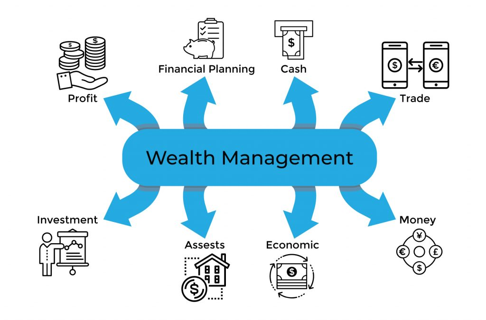
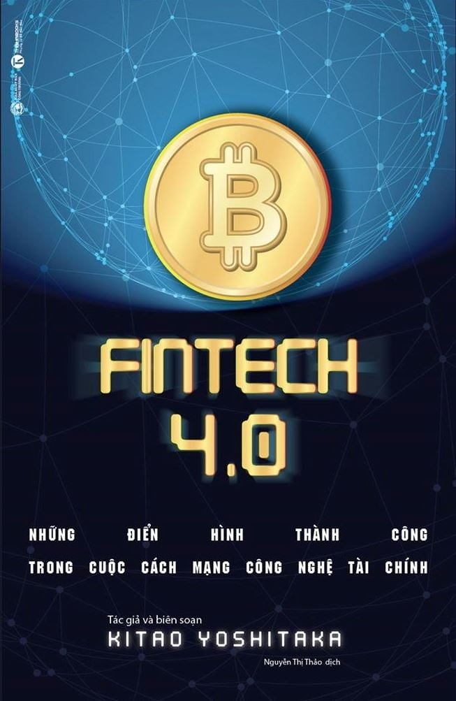
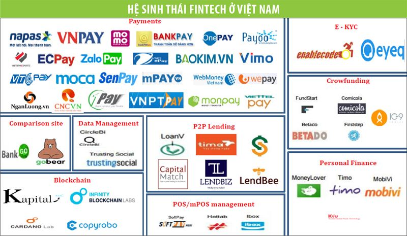
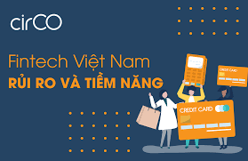

# **`GIỚI THIỆU FINTECH`**

* [Cuộc Cách mạng FinTech](#Cuộc-Cách-mạng-FinTech)
* [Tập đoàn SBI](#Tập-đoàn-SBI)
* [Thực trạng của Fintech Việt Nam](#Thực-trạng-của-Fintech-Việt-Nam)

# Cuộc Cách mạng FinTech

- Công nghệ thông tin và Internet ngày càng phát triển đã và đang đổ bộ vào hầu hết các khu vực trên thế giới ở mọi ngóc ngách của đời sống xã hội. `Ngành tài chính – ngân hàng`, một trong những ngành kinh tế hiện đại, tất nhiên cũng không nằm ngoài xu thế này.

    

- Khái niệm FinTech - `Financial Technology` ra đời và là một làn sóng mới làm `thay đổi toàn bộ` cách thức cung ứng và vận hành các dịch vụ tài chính cũng như mô hình tổ chức đã có trước nay. Fintech đề cập đến việc `tận dụng sáng tạo công nghệ` trong các hoạt động và dịch vụ tài chính. Fintech là các ứng dụng, qui trình, sản phẩm, mô hình kinh doanh mới trong ngành dịch vụ tài chính, bao gồm một hay nhiều dịch vụ tài chính bổ sung và được cung cấp như một qui trình ‘từ đầu cuối tới đầu cuối’ qua mạng internet, nhằm mục đích cải thiện hiệu suất và độ tin cậy của hoạt động ngân hàng và đầu tư.

- `FinTech 1.0` là một hệ sinh thái dịch vụ tài chính trực tuyến kết hợp ngân hàng, chứng khoán, bảo hiểm,... bao gồm các ứng dụng web hiện nay. Sau đó, `việc ứng dụng những công nghệ mới` (AI, big data, IoT,...) `vào các ứng dụng web` đã tạo ra các sản phẩm tài chính hiệu quả hơn. Làn sóng này thực chất là sự phát triển của FinTech 1.0 nên có thể gọi là 1.5. Đồng thời ứng dụng cả công nghệ blockchain vào hệ sinh thái tài chính trực tuyến chạy trên web tạo tiền đề cho sự phát triển hệ sinh thái tài chính blockchain (FinTech 2.0)

- `Phiên bản 2.0` hoàn toàn `dựa trên nền tảng công nghệ blockchain` và không nhất thiết cần đến web như các phiên bản 1.0 và 1.5. Sự xuất hiện của hệ thống web dùng trên Internet đã hiện thực hóa việc trao đổi thông tin đa chiều đa dạng một cách hoàn toàn tự do với quy mô trên toàn thế giới. Trong khi đó, hệ thống blockchain lại giúp thực hiện các giao dịch trao đổi giá trị toàn cầu trên Internet. Bởi vậy, hai hệ thống này tuy song song tồn tại nhưng lại khác nhau về bản chất.

- Khác với thị trường tài chính truyền thống gồm hai đối tượng các định chế tài chính (ngân hàng, công ty tài chính, đầu tư, bảo hiểm, chứng khoán…) và khách hàng, `đối tượng của Fintech` gồm 3 bên, tác động qua lại lẫn nhau:
    - `Các định chế tài chính`: Thực thể quan trọng trong ngành tài chính, các định chế này ngày càng hợp tác sâu rộng với các công ty Fintech do nhận thấy tầm quan trọng của công nghệ. Đồng thời bản thân các định chế này cũng trực tiếp đầu tư vào các công ty Fintech hay các hoạt động nghiên cứu để chủ động nắm giữ công nghệ mới và chiếm giữ thị trường.
    - `Các công ty Fintech`: Các công ty độc lập hoạt động trong lĩnh vực công nghệ thông tin cung cấp các sản phẩm, dịch vụ mới trong lĩnh vực tài chính. Khách hàng của các công ty này có thể là người sử dụng cuối cùng, cũng có thể là các định chế tài chính.
    - `Khách hàng`: Người sử dụng sản phẩm dịch vụ tài chính nói chung. Với các ứng dụng công nghệ mới, khách hàng là những người được hưởng lợi nhiều nhất từ cạnh tranh giữa các công ty, định chế tài chính cũng như từ những tiện ích công nghệ mới mang lại.

    

- Một số sản phẩm Fintech tiêu biểu:
    - `Ví điện tử`: một loại tài khoản điện tử, nó đóng vai trò là phương tiện thanh toán trực tuyến dành cho khách hàng, giúp khách hàng thanh toán các loại chi phí, gửi tiền và nhận tiền qua Internet một cách nhanh chóng. Một số loại Ví điện tử nổi tiếng nhất trên thế giới có thể kể đến như: PayPal, Alipay,  Google Wallet,...
    - `Đồng tiền điện tử Bitcoin`: Bitcoin là một loại tiền tệ kỹ thuật số phân cấp. Bitcoin có thể được trao đổi trực tiếp bằng thiết bị kết nối Internet mà không cần thông qua một tổ chức tài chính trung gian nào. Chẳng hạn, một người hay một công ty ở Mỹ, chỉ cần qua vài thao tác trên điện thoại kết nối internet, có thể chuyển tiền Bitcoin ngay cho đối tác bên Nhật không cần qua ngân hàng hay bất cứ trung gian nào khác.
    - `Chuyển tiền ngang cấp`: cung cấp dịch vụ chuyển tiền ra nước ngoài với mục đích là giúp các khách hàng có thể chuyển tiền ra nước ngoài với mức phí hợp lý, không bị các ngân hàng `bóc lột`.
    - `Gọi vốn cộng đồng`: cho phép các nhà phát triển, kinh doanh, sáng tạo có khả năng đem dự án của mình ra huy động vốn từ những người tiêu dùng thông thường trên mạng internet một cách dễ dàng và đơn giản hơn rất nhiều.

# Tập đoàn SBI

    

## Chiến lược thực tế trong ngành tài chính

- Trong giai đoạn đầu, SBI đã nhanh chóng `ứng dụng kỹ thuật và dịch vụ mới vào hệ sinh thái dịch vụ tài chính của tập đoàn` (FinTech 1.0) nhằm nhanh chóng dịch chuyển sang thế giới FinTech 1.5. SBI thực chất không phải tiến hành các dự án nghiên cứu mà là áp dụng chiến lược "mượn gió bẻ măng". Nhìn xung quanh, SBI suy nghĩ lợi thế của mình là tài chính, tại sao không hỗ trợ các công ty khởi nghiệp trong và ngoài nước, đồng thời hai bên cùng có lợi, sẽ có thể tiếp cận được những kỹ thuật mới từ họ. Để hiện thực hóa ý tưởng, SBI đã thành lập `Quỹ FinTech` chuyên đầu tư vào các công ty khởi nghiệp hàng đầu sở hữu các kỹ thuật thuộc nhiều lĩnh vực khác nhau, thông qua đó tiếp cập công nghệ của các công ty này.

- Giai đoạn hai, SBI nhanh chóng `tích hợp các công nghệ mới của FinTech 1.5` vào hệ sinh thái dịch vụ tài chính của tập đoàn nhằm nâng cao lợi ích của khách hàng, tạo lợi thế cạnh tranh.

- Đến giai đoạn ba, SBI tiến hành `ứng dụng thực tế FinTech 2.0 hay công nghệ Blockchain vào một loạt các dịch vụ tài chính`. Tuy nhiên phải nghiên cứu kĩ càng xem lĩnh vực nào có khả năng ứng dụng, đồng thời cân nhắc hiệu quả tạo ra từ những ứng dụng đó (ứng dụng trong các giao dịch trái phiếu, hoán đổi,...).

- Ở giai đoạn cuối, SBI sẽ liên kết hợp tác không chỉ tại Nhật Bản mà còn `xây dựng những liên kết toàn cầu` với đối tác lớn trên thế giới trong lĩnh vực tiền kỹ thuật số và công nghệ blockchain (hợp tác với công ty Ripple để tạo ra liên doanh SBI Ripple Asia hay tham gia vào liên minh blockchain quốc tế R3 của Mỹ hướng đến sự liên kết vào tiêu chuẩn toàn cầu về blockchain).

## Hệ sinh thái tài chính và ưu thế chiến lược

- Nhiều công ty thuộc FinTech 1.5 và 2.0 là các công ty khởi nghiệp mới thành lập, và có nền tảng kinh doanh còn rất mong manh. Thật đáng tiếc là nhiều doanh nghiệp trong số đó có những công nghệ rất tốt nhưng lại chưa biết các kiếm tiền từ chúng và dần biến mất. SBI đã nghiên cứu trong một thời gian dài về tình trạng này và đưa ra cách giải quyết tốt nhất cho cả ba đối tượng SBI, công ty khởi nghiệp đối tác đầu tư và đặc biệt là các khách hàng của SBI:
    - Thiết lập hệ sinh thái doanh nghiệp kinh doanh dịch vụ tài chính.
    - Thành lập tổ chức đầu tư mạo hiểm và hợp tác với công ty đối tác đầu tư - việc này đòi hỏi sự hợp tác chặt chẽ với các công ty thành viên trong hệ sinh thái để nghiên cứu và thực nghiệm các ứng dụng.
    - Ứng dụng công nghệ của công ty đối tác đầu tư vào công ty thành viên của hệ sinh thái nhằm tăng trưởng lợi nhuận cho cả hai.

## Tầm nhìn lựa chọn doanh nghiệp tăng tốt

- Sau khi thành lập quỹ đầu tư FinTech, quỹ này không chỉ đơn thuần đầu tư vào các công ty khởi nghiệp, mà còn kết hợp ứng dụng công nghệ mới của các công ty này vào dịch vụ tài chính của các công ty thành viên tập đoàn và công ty tài chính khác đầu tư vào quỹ, từ đó giúp phát triển dịch vụ của các công ty khởi nghiệp trong một hệ sinh thái kinh tế quy mô lớn. 

    

- Vậy làm thế nào để lựa chọn các công ty khởi nghiệp khi vận hành quỹ. Có bốn điểm cần lưu ý khi lựa chọn đầu tư vào các công ty đó:
    - `Thị trường và đối tượng khách hàng`: tiềm năng tăng trường, tiềm năng lợi nhuận, môi trường cạnh tranh, mức độ phát triển công nghệ,...
    - `Đội ngũ lãnh đạo công ty`: khả năng thu phục lòng người, từ đối tác đến nhân viên, để có thể thực hiện các quyết định đúng đắn cũng như tạo ra các đột phá.
    - `Chiến lược kinh doanh`: ngoài tận dụng sự nhanh nhạy nhờ quy mô gọn nhẹ vốn có để tham gia thị trường, doanh nghiệp kinh doanh mạo hiểm cần có sự chuẩn bị kỹ lưỡng về mặt chiến lược để giành được lợi thế cạnh tranh trong việc cung cấp dịch vụ như sử dụng `những kỹ thuật mới tiên tiến` mà các doanh nghiệp hiện hữu không có, hay đưa ra `chiến lược giá cả` mà các công ty lớn không thể áp dụng được.
    - `Điều kiện đầu tư`: điều kiện mà cá nhân tổ chức phải đáp ứng theo quy định của pháp luật (giấy phép,...) khi thực hiện hoạt đồng đầu tư, kinh doanh trong các ngành nghề.

# Thực trạng của Fintech Việt Nam

- Việt Nam là quốc gia sở hữu nhiều điều kiện thuận lợi và tiềm năng cho sự phát triển của lĩnh vực Fintech. Hiện Việt Nam đang có tới 40 triệu Smartphone, con số này sẽ tăng lên 60 triệu vào năm 2018, nhưng hiện tại mới chỉ có dưới 5% người dùng Mobile sử dụng các ứng dụng của ngân hàng. Bên cạnh đó, hệ sinh thái Fintech tại Việt Nam chưa có sự kết nối chặt chẽ giữa các chủ thể liên quan (bao gồm cơ quan quản lý, các định chế tài chính, công ty Fintech và các doanh nghiệp khởi nghiệp, quỹ đầu tư, hạ tầng tài chính, viễn thông…). Lĩnh vực Fintech ở Việt Nam còn khá mới mẻ dù các công ty trung gian thanh toán đã xuất hiện vào năm 2008. Hiện nay, thị trường chỉ có khoảng 40 công ty hoạt động trong các lĩnh vực khác nhau, trong đó phần lớn tập trung vào mảng thanh toán. Ngoài ra, thị trường Fintech Việt Nam còn có một số doanh nghiệp khởi nghiệp hoạt động ở những lĩnh vực khác như gọi vốn cộng đồng, dịch vụ cho vay trực tuyến…, nhưng đều ở qui mô nhỏ. Các loại hình Fintech khác như sàn giao dịch cho vay ngang hàng, quản lý đầu tư tự động, giao dịch tiền ảo… gần như lặng lẽ và vẫn chưa có cơ chế pháp lý tương ứng.

    

- Các ứng dụng đa dạng của Fintech đang tác động đến hầu hết mọi lĩnh vực hoạt động của ngành tài chính. `Những tác động lớn nhất` đến thế giới nói chung cũng như Việt Nam nói riêng có thể kể đến như:
    - `Làm thay đổi kênh phân phối và các sản phẩm dịch vụ tài chính truyền thống`, đặc biệt là dịch vụ ngân hàng với xu thế phát triển mạnh trong những năm gần đây của các kênh bán hàng qua Internet, Mobilebanking, Tablet Banking, mạng xã hội, phát triển ngân hàng kỹ thuật số, giao dịch không giấy tờ…
    - `Fintech với các ứng dụng công nghệ cao`, chẳng hạn như ứng dụng dữ liệu lớn (Big Data) sẽ giúp phân tích hành vi khách hàng sẽ giúp cho các định chế tài chính thu thập dữ liệu bên trong và bên ngoài nhằm tiết giảm chi phí, hỗ trợ cho các quá trình ra quyết định, và nâng cao chất lượng dịch vụ, mang lại giá trị gia tăng cũng như sự hài lòng hơn cho khách hàng.
    - `Xu hướng “ngân hàng không giấy”, “tổ chức tài chính không giấy”` sẽ trở nên phổ biến và là thách thức không nhỏ của ngành dịch vụ tài chính trong việc giảm dần vai trò của các chi nhánh. Việc cạnh tranh thông qua mở rộng mạng lưới các chi nhánh sẽ dần chấm dứt, do chi phí hoạt động cao. Thay vào đó, cạnh tranh công nghệ tài chính hiện đại cũng trở nên gay gắt hơn trong các định chế tài chính.
    - `Thị phần của các ngân hàng nói chung và các định chế tài chính nói riêng` có xu hướng giảm bớt, chia phần cho các công ty Fintech. Chẳng hạn như, các ngân hàng hoàn toàn đứng ngoài cuộc trong dịch vụ tiền ảo Bitcoin, một hệ thống tiền tệ mới đang ngày càng lớn mạnh trên phạm vi toàn cầu.
    - `Thị trường lao động trong lĩnh vực tài chính, ngân hàng cũng sẽ có sự thay đổi`, công nghệ có thể thay thế cho lượng lớn nhân viên của các ngân hàng, tổ chức tài chính, công ty chứng khoán, bảo hiểm… Mặc dù vậy, nhu cầu về nguồn nhân lực chất lượng cao sẽ gia tăng (giỏi cả về chuyên môn nghiệp vụ tài chính và công nghệ thông tin).

- Không nằm ngoài guồng quay của thế giới, các định chế tài chính tại Việt nam cũng `nhận định rõ tầm quan trọng và ảnh hưởng ngày càng lớn của Fintech trong hoạt động kinh doanh tài chính`. Hệ thống internet banking, mobile banking… đã và đang được hoàn thiện ở hầu hết các ngân hàng. Các công ty chứng khoán, quỹ đầu tư, công ty bảo hiểm cũng tích cực dành ngân sách cho công nghệ đặc biệt trong các mảng an ninh mạng, quản trị khách hàng.

    

- Tuy nhiên, hầu hết các ngân hàng và các tổ chức tài chính tại Việt nam tập trung vào khâu nâng cao năng lực công nghệ trong chính nội tại tổ chức hơn là chủ động phát triển các sản phẩm Fintech mới hay đầu tư vào các công ty Fintech. 

- Có rất nhiều lý do để các định chế tài chính trước mắt chỉ `chạy vòng ngoài` trong Fintech. Nguyên nhân xuất phát từ qui mô thị trường, từ năng lực và ngân sách tài chính của doanh nghiệp, từ hành vi của khách hàng… Nhưng những nguyên nhân quan trọng nhất vẫn xuất phát từ đặc thù của thị trường Việt nam. Các `mô hình giao dịch ngân hàng và dịch vụ tài chính truyền thống trước mắt vẫn chưa bị ảnh hưởng nhiều`, nhất là khi các mô hình Fintech hiện nay tại Việt Nam còn rất sơ khai chưa đủ lực cạnh tranh với mô hình truyền thống.

- Ngoài ra, việc quản lý cũng như `cung cấp các thông tin đầu vào về công dân, hồ sơ cá nhân` tại Việt Nam còn nhiều hạn chế, trong khi đây lại là một trong những cơ sở dữ liệu quan trọng cho việc phát triển các dịch vụ theo mô hình Fintech. Một vấn đề nữa là các quy định, luật lệ chưa minh bạch, `hành lang pháp lý chưa theo kịp tốc độ phát triển của các công ty Fintech`, nên rủi ro về pháp lý cho một số dịch vụ của mô hình Fintech là hiện hữu.

- Vì vậy, với các định chế tài chính tại Việt nam, các kênh giao dịch truyền thống vẫn đang là lựa chọn được ưu tiên. Tuy nhiên với sự phát triển nhanh chóng của dịch vụ Fintech trên thế giới, sự phổ biến ngày càng lớn của internet và tốc độ tăng trưởng kinh tế của Việt nam như hiện nay, chắc chắn các tổ chức này sẽ sớm phải xem xét và tham gia đầy đủ, toàn diện hơn nữa vào phạm trù Fintech.

# Tham khảo

- [Fintech: Những thông tin cơ bản nhất về Fintech (phần 1)](https://doimoisangtao.vn/news/2017/10/25/fintech-nhng-thng-tin-c-bn-nht-v-fintech-phn-1-j78bk)
- [Fintech: Một số sản phẩm Fintech tiêu biểu (phần 2)](https://doimoisangtao.vn/news/2017/10/2/fintech-bi-2-s5892?rq=fintech)
- [Fintech: Các định chế tài chính thế giới phản ứng ra sao trước làn sóng Fintech (phần 3)](https://doimoisangtao.vn/news/2017/10/1/fintech-bi-3?rq=fintech)
- [Fintech: Startup Fintech tại Việt nam nên làm thế nào? (phần 4)](https://doimoisangtao.vn/news/2017/10/30/fintech-bi-4)

