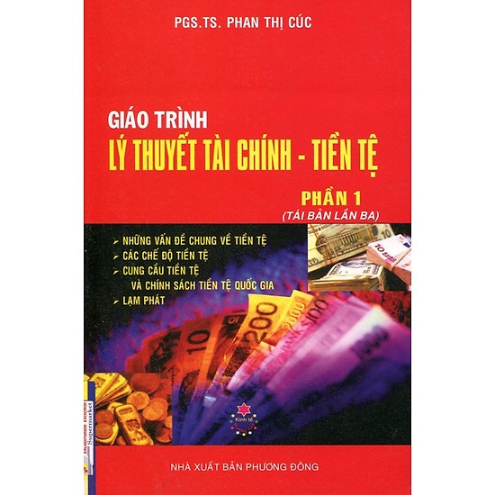
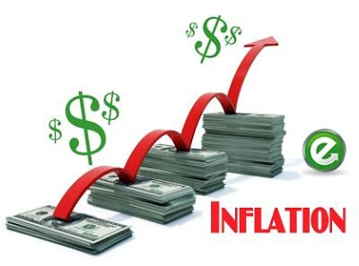
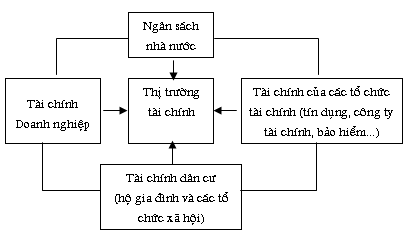
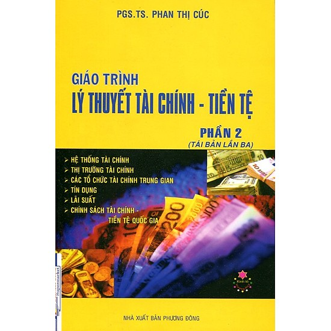
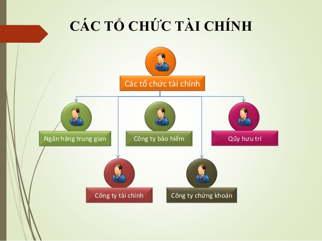

# **`LÝ THUYẾT TÀI CHÍNH - TIỀN TỆ`**

* [Tiền tệ](#Tiền-tệ)
* [Chế độ tiền tệ](#Chế-độ-tiền-tệ)
* [Cung cầu tiền tệ và chính sách tiền tệ quốc gia](#Cung-cầu-tiền-tệ-và-chính-sách-tiền-tệ-quốc-gia)
* [Lạm phát](#Lạm-phát)
* [Hệ thống tài chính](#Hệ-thống-tài-chính)
* [Thị trường tài chính](#Thị-trường-tài-chính)
* [Các tổ chức tài chính trung gian](#Các-tổ-chức-tài-chính-trung-gian)
* [Tín dụng](#Tín-dụng)
* [Lãi suất](#Lãi-suất)
* [Chính sách tài chính - tiền tệ quốc gia](#Chính-sách-tài-chính---tiền-tệ-quốc-gia)

# Tiền tệ

- Ở cuối thời kỳ công xã nguyên thủy, công cụ lao động ngày càng tiến hóa (từ đồ đá sang đồ đồng, đồ sắt) dẫn đến dư thừa của cải kiếm được. Từ đó, chế độ tư hữu xuất hiện, rồi nảy sinh việc trao đổi hàng hóa. Ban đầu là trực tiếp hàng đổi hàng, sau đó mua bán thông qua tiền tệ.

    

- Về bản chất, tiền tệ là `vật ngang giá chung`, làm phương tiện để trao đổi hàng hóa, dịch vụ và thanh toán các khoản nợ. Tiền tệ có 4 chức năng cơ bản:
    - `Phương tiện trao đổi`: dùng để mua bán hàng hóa, dịch vụ hoặc thanh toán các khoản nợ trong và ngoài nước. Việc dùng tiền làm phương tiện trao đổi đã nâng cao hiệu quả hoạt động của nền kinh tế, bởi nó đã tiết kiệm được các chi phí quá lớn trong quá trình trao đổi trực tiếp (hàng đổi hàng).
    - `Đơn vị đo lường giá trị của hàng hóa`: người ta đo giá trị của hàng hóa và dịch vụ bằng tiền giống như người ta đo trọng lượng hay chiều dài của một vật. Vì vậy, biểu hiện bằng tiền của giá trị hàng hóa chính là giá cả của hàng hóa đó.
    - `Phương tiện dự trữ về mặt giá trị`: tiền tệ là nơi chứa giá trị, có nghĩa là nơi chứa sức mua hàng hóa trong một thời gian nhất định.
    - `Tiền tệ thế giới`: khi hàng hóa vượt khỏi biên giới quốc gia thì tiền làm chức năng tiền tệ thế giới - ban đầu là vàng bạc, sau đó là một số đồng tiền quốc gia mạnh.

- Trong quan hệ trao đổi, `hình thái giá trị` được biểu hiện qua bốn hình thái chủ yếu sau đây:
    - `Hình thái giá trị giản đơn hay ngẫu nhiên`: giá trị (tương đối) của một vật được biểu hiện ở giá trị của một vật khác duy nhất đóng vai trò vật ngang giá `đơn nhất` với ba đặc điểm: `giá trị sử dụng` trở thành hình thái biểu hiện của giá trị, `lao động cụ thể` trở thành hình thái biểu hiện của lao động trừu tượng, `lao động tư nhân` trở thành lao động xã hội trực tiếp.
    - `Hình thái giá trị toàn bộ hay mở rộng`: giá trị của một vật được biểu hiện ở giá trị sử dụng của hàng hóa khác, có tác dụng làm vật ngang giá `đặc thù`. Những vật ngang giá đặc thù tồn tại song song với nhau và đều có quyền lực như nhau trong vai trò vật ngang giá.
    - `Hình thái giá trị chung`: giá trị chung của tất cả các hàng hóa biểu hiện giá trị của chúng ở một hàng hóa đóng vai trò vật ngang giá chung - `trao đổi hàng hóa một cách gián tiếp`.
    - `Hình thái giá trị tiền tệ`: thị trường càng mở rộng thì tình trạng có nhiều vật ngang giá chung gây khó khăn cho lưu thông trao đổi hàng hóa. Vật ngang giá chung bằng kim loại dần dần thay thế và cố định ở Vàng. Lúc này, hình thái giá trị tiền tệ mới được xác lập và Vàng với tư cách là vật ngang giá chung đã trở thành tiền tệ.

# Chế độ tiền tệ

- Chế độ tiền tệ là `hình thức tổ chức lưu thông tiền tệ` của một quốc gia, được quy định bằng luật pháp, gồm ba nhân tố:
    - `Bản vị tiền tệ`: cơ sở định giá đồng tiền quốc gia, là tiêu chuẩn chung mà mỗi nước chọn làm cơ sở cho chế độ tiền tệ.
    - `Đơn vị tiền tệ`: mỗi quốc gia đều có đơn vị tiền tệ riêng và được quy định bằng pháp luật, gồm `tên gọi - ký hiệu` và `tiêu chuẩn đo lường`.
    - `Công cụ trao đổi`: là những công cụ được sử dụng để thực hiện mua bán hàng hóa, dịch vụ hoặc thanh toán các khoản nợ như tiền giấy, tiền kim loại, tiền ghi sổ, tiền điện tử,...

- Chế độ lưu thông tiền kim loại:
    - `Chế độ bản vị bạc`: đồng tiền của một nước được đảm bảo rằng một trọng lượng bạc nhất định theo pháp luật của nước đó.
    - `Chế độ song vị`: đồng tiền của một nước được xác định bằng một trọng lượng cố định của hai kim loại, thường là vàng và bạc.
    - `Chế độ bản vị vàng`: đồng tiền của một nước được đảm bảo bằng một trọng lượng vàng nhất định theo pháp luật.
    - `Chế độ bản vị vàng thỏi`: cũng quy định cho đơn vị tiền tệ quốc gia một trọng lượng vàng cố định. Nhưng vàng được đúc thành thỏi mà không đúc thành tiền.
    - `Chế độ bản vị vàng hối đoái`: tiền giấy quốc gia không được trực tiếp chuyển đổi ra vàng, muốn đổi ra vàng phải thông qua một ngoại tệ. Ngoại tệ đó phải được tự do chuyển đổi ra vàng, như đôla Mỹ, bảng Anh,...
    - `Chế độ bản vị ngoại tệ`: đơn vị tiền tệ quốc gia được xác định bằng đơn vị tiền tệ của nước ngoài (ngoại tệ). Đó phải là các ngoại tệ mạnh và được tự do chuyển đổi trên thị trường.
    - Chế độ tiền giấy không chuyển đổi ra vàng có bản vị là `sức mua hàng hóa dịch vụ`: đơn vị tiền tệ của một nước không thể tự do chuyển đổi ra kim loại quý, mà giá trị thực tế của đồng tiền các nước phụ thuộc vào sức mua của nó, tức là số lượng hàng hóa hay dịch vụ mà có thể mua được.

# Cung cầu tiền tệ và chính sách tiền tệ quốc gia

- `Cung tiền tệ` là khối lượng tiền cung ứng của nền kinh tế đảm bảo các nhu cầu sản xuất lưu thông hàng hóa, cũng như các nhu cầu sản xuất lưu thông hàng hóa, cũng như các nhu cầu chi tiêu trao đổi khác của nên kinh tế xã hội.

- Lượng tiền cung ứng bao gồm các khối tiền cơ bản sau:
    - `Khối tiền tệ M1`: là tiền mạnh mang ý nghĩa loại tiền có tính thanh khoản cao nhất trong các khối tiền tệ,khối tiền tệ này còn gọi là tiền theo nghĩa hẹp, nhưng là một loại tài sản không sinh lợi cho nên nó không mang tính chất như một khoản đầu tư. Bao gồm: tiền mặt lưu hành + tiền gửi không kỳ hạn.
    - `Khối tiền tệ M2`: vừa là tiền, vừa là khoản sinh lợi. Kinh tế càng phát triển càng có xu hướng chuyển tiền từ loại không sinh lãi (M1) sang các loại đem lại lãi suất như M2, M3, L. Bao gồm: M1 + tiền gửi có kỳ hạn + chứng chỉ tiền gửi + tiền gửi trong các quỹ tín dụng của thị trường tiền tệ.
    - `Khối tiền tệ M3`: bao gồm M2 + tiền gửi lớn có kỳ hạn và trái phiếu dài hạn mua lại của ngân hàng thương mại.
    - `Khối tiền tệ L`: bao gồm M3 + trái phiếu (kho bạc, công ty,...) + cổ phiếu,...

- Việc phân loại tiền thành M1, M2, M3, L nhằm giúp ngân hàng trung ương chính phủ theo dõi mức độ đầu tư trong nước vào các tài sản sinh lợi; giúp nền kinh tế huy động một cách tốt nhất các nguồn lực; đồng thời đáp ứng nhu cầu cần sự gọn nhẹ, bảo đảm, có lãi cho tài sản và dễ dàng trong thanh toán ở mọi nơi mọi lúc.

- `Cầu tiền tệ` là tổng khối tiền tệ mà Nhà nước, các tổ chức kinh tế và cá nhân cần có để thỏa mãn các nhau cầu.

- Cân đối cung cầu tiền tệ:
    - `Quan điểm của C.Mác`: khối lượng tiền cần thiết cho lưu thông tỉ lệ thuận với tổng giá cả hàng hóa và tỉ lệ nghịch với tốc độc lưu thông tiền tệ.
    - `Quan điểm học thuyết Số lượng Tiền tệ hiện đại của M.Friedman`: số lượng tiền tệ tỉ lệ thuận với tương quan của thu nhập tiền tệ trong thu nhập, chỉ số giá cả và thu nhập quốc dân tính theo giá không đổi.

- `Chính sách tiền tệ` là quá trình quản lý cung tiền của cơ quan quản lý tiền tệ, thường là hướng tới một lãi suất mong muốn để đạt được những mục đích ổn định và tăng trưởng kinh tế, như kiềm chế lạm phát, duy trì ổn định tỷ giá hối đoái, giải quyết việc làm cho người lao động, tăng trưởng kinh tế,...

# Lạm phát

- `Lạm phát` là hiện tượng cung tiền tệ tăng lên kéo dài làm cho mức giá cả chung tăng nhanh tồn tại trong một thời gian dài.

    

- Nguyên nhân:
    - Theo ba quan điểm, `đồng nhất giữa lạm phát và tăng giá`, `lạm phát lưu thông tiền tệ`, `lạm phát nhu cầu và chi phí đẩy` đều cho rằng nguyên nhân làm tăng giá cả là nguyên nhân gây ra lạm phát.
    - Xét theo `nguồn gốc` gồm `nguyên nhân cơ bản và sâu xa` (nền kinh tế quốc dân bị mất cân đối, sản xuất sút kém, ngân sách quốc gia bị thâm hụt), `nguyên nhân trực tiếp` (cung tiền tệ tăng trưởng quá mức cần thiết), `nguyên nhân quan trọng` (hệ thống chính trị bị khủng hoảng làm lòng tin của người dân bị xói mòn, uy tín và sức mạnh đồng tiền bị giảm sút, họ không tiêu xài và đánh giá thấp giấy bạc mà nhà nước phát hành).
    - Xét theo `quan điểm chủ quan` (chính sách quản lý kinh tế không phù hợp của nhà nước) và `khách quan` (kinh tế bị tàn phá bởi chiến tranh, thiên tai,... và tình hình biến động của thị trường nhiên liệu, vàng, ngoại tệ trên thế giới).

- Do biểu hiện đặc trưng của lạm phát là `giá cả hàng hóa tăng liên tục`, nên người ta thường căn cứ vào chỉ số giá cả hàng hóa tăng để phân loại lạm phát:
    - `Lạm phát vừa phải` - lạm phát một con số: biểu hiện ở giá cả hàng hóa tăng chậm trong khoảng 10% trở lại. Trong đó đồng tiền mất giá không lớn, chưa ảnh hưởng nhiều đến sản xuất kinh doanh. Loại lạm phát này thường được các nước có nền kinh tế phát triển duy trì như một chất xúc tác cho nền kinh tế phát triển.
    - `Lạm phát phi mã`: xảy ra khi giá cả bắt đầu tăng với tỉ lệ hai con số, ảnh hưởng đến đời sống kinh tế xã hội.
    - `Siêu lạm phát`: xảy ra khi tốc độ tăng giá vượt xa lạm phát phi mã, thường là từ ba con số trở lên, có tác động rất lớn đến nền kinh tế.

# Hệ thống tài chính

- `Tài chính` là phạm trù kinh tế, phản ánh các quan hệ phân phối của cải xã hội dưới hình thức giá trị. Phát sinh trong quá trình hình thành, tạo lập, phân phối các quỹ tiền tệ của các chủ thể trong nền kinh tế nhằm đạt mục tiêu của các chủ thể ở mỗi điều kiện nhất định.

- Bản chất: `sự vận động độc lập tương đối` của tiền tệ trong quá trình tạo lập và sử dụng các quỹ tiền tệ của các chủ thể trong nền kinh tế - xã hội.

- Chức năng của tài chính:
    - Phân phối của cải xã hội dưới hình thức giá trị
    - Giám sát bằng đồng tiền đối với các quá trình phân phối
    - Huy động, tạo lập vốn

- `Hệ thống tài chính` là tổng thể các hoạt động tài chính trong các lĩnh vực khác nhau của nền kinh tế quốc dân, nhưng thống nhất với nhau về bản chất, chức năng, và có liên hệ hữu cơ với nhau về sự hình thành và sử dụng các quỹ tiền tệ ở các chủ thể kinh tế - xã hội hoạt động trong các lĩnh vực đó. Bao gồm nhiều khâu tài chính hợp thành:
    - Tài chính nhà nước (chủ yếu là ngân sách Nhà nước)
    - Tài chính trung gian (bảo hiểm, tín dụng,...)
    - Tài chính các tổ chức xã hội và tài chính hộ gia đình (dân cư)
    - Tài chính doanh nghiệp

    

# Thị trường tài chính

- là thị trường trong đó các loại vốn ngắn hạn, trung hạn, dài hạn được chuyển từ nơi `thừa` sang nơi `thiếu` để đáp ứng nhu cầu phát triển nền kinh tế xã hội, là nơi gặp gỡ giữa những bên có nguồn vốn dư thừa với những bên có nhu cầu sử dụng chúng.

- Cấu trúc, phân loại thị trường tài chính:
    - Căn cứ vào `thời gian sử dụng nguồn tài chính huy động được`: thị trường tiền tệ và thị trường vốn.
    - Căn cứ vào `phương thức huy động nguồn tài chính`: thị trường nợ và thị trường vốn cổ phần.
    - Căn cứ vào `sự luân chuyển các nguồn tài chính`: thị trường sơ cấp và thị trường thứ cấp.
    - Căn cứ vào `tính chất pháp lý`: thị trường tài chính chính thức và không chính thức.

- Chức năng của thị trường tài chính:
    - Cho phép vốn chuyển từ những người, những doanh nghiệp không có cơ hội đầu tư tới những người, những doanh nghiệp có cơ hội đầu tư.
    - Chung cấp vốn cho các cá nhân và doanh nghiệp có đủ khả năng thanh toán trả mà không phải chờ đợi một thời gian tích lũy.
    - Là một hoạt động hữu hiệu để cải thiện đời sống kinh tế của mỗi thành viên trong xã hội.
    - Nâng cao năng suất và hiệu quả sử dụng vốn của toàn bộ nền kinh tế.

    

- `Thị trường tiền tệ` là một thị trường tài chính, trong đó đối tượng giao dịch, mua bán, trao đổi trên thị trường là các `khoản vốn ngắn hạn` hay nói cách khác là nguồn tài chính có thời hạn sử dụng kỳ hạn thanh toán dưới một năm. Các `công cụ` của thị trường tiền tệ bao gồm tín phiếu kho bạc, các loại thương phiếu, kỳ phiếu, chứng chỉ tiền gửi, kỳ phiếu ngân hàng, các khế ước cho vay.

- `Thị trường vốn` là một bộ phận của thị trường tài chính trong đó có những công cụ vay nợ trung và dài hạn trên một năm và cấc chứng khoán được mua bán.

# Các tổ chức tài chính trung gian

- là các tổ chức tài chính thực hiện chức năng dẫn vốn từ người có vốn tới người cần vốn. Bao gồm các chức năng:
    - Tạo vốn
    - Cung ứng vốn
    - Kiểm soát

    

- Tổ chức tài chính trung gian bao gồm hai loại chủ yếu sau đây:
    - `Tổ chức tín dụng ngân hàng`: là doanh nghiệp hoạt động kinh doanh tiền tệ, làm dịch vụ ngân hàng với nội dung nhận tiền gửi và sử dụng tiền gửi để cấp tín dụng, cung ứng các dịch vụ thanh toán qua tài khoản ngân hàng.
    - `Tổ chức tín tài chính phi ngân hàng`: là loại hình tổ chức tín dụng được thực hiện một số hoạt động như là nội dung kinh doanh thường xuyên của ngân hàng nhưng không được nhận tiền gửi của cá nhân, không làm dịch vụ thanh toán qua tài khoản của ngân hàng, gồm các công ty bảo hiểm, tài chính, chứng khoán; quỹ đầu tư, trợ cấp,...

# Tín dụng

- là quan hệ vay mượn dựa trên nguyên tắc có hoàn trả (cả vốn và lãi) sau một thời gian nhất định.

- Chức năng của tín dụng:
    - Tập trung và phân phối lại vốn, tài sản trên cơ sở có hoàn trả.
    - Kiểm tra, giám sát bằng tiền đối với các hoạt dộng kinh tế xã hội.

- Các hình thức của tín dụng:
    - `Tín dụng thương mại` phản ánh các quan hệ sử dụng vốn lẫn nhau giữa những người sản xuất kinh doanh, được thực hiện dưới hình thức mua bán chịu hàng hóa.
    - `Tín dụng ngân hàng` phản ánh quan hệ vay mượn vốn tiền tệ giữa các ngân hàng với các chủ thể kinh tế khác trong nền kinh tế (các doanh nghiệp, các cá nhân, các tổ chức xã hội, và các cơ quan nhà nước các cấp). Trong tín dụng ngân hàng, ngân hàng xuất hiện với tư cách là người huy động vốn bằng tiền và cho vay (cấp tín dụng) cho các đối tượng nói trên.
    - `Tín dụng thuê mua` phản ánh những quan hệ nảy sinh giữa công ty tài chính (công ty cho thuê tài chính) với những người sản xuất kinh doanh dưới hình thức cho thuê tài sản.
    - `Tín dụng cho vay tiêu dùng` là hình thức tài trợ cho mục đích chi tiêu của cá nhân, hộ gia đình.
    - `Tín dụng quốc tế` phản ánh mối quan hệ kinh tế giữa các chủ thể kinh tế của một quốc gia với các chủ thể kinh té của các quốc gia khác và các tổ chức quốc tế.

# Lãi suất

- là `giá cả của tín dụng`, vì nó là giá của quyền được sử dụng vốn vay trong một khoảng thời gian nhất định, mà người sử dụng phải trả cho người cho vay; là tỉ lệ của tổng số tiền phải trả so với tổng số tiền vay trong một khoảng thời gian nhất định.

    

- Lãi suất là giá mà người vay phải trả để được sử dụng tiền không thuộc sở hữu của họ và là lợi tức người cho vay có được đối với việc trì hoãn chi tiêu.

- Nhân tố ảnh hưởng đến lãi suất: mức cung cầu tiền tệ, lạm phát, sự bất ổn của nền kinh tế, các chính sách của nhà nước.

# Chính sách tài chính - tiền tệ quốc gia

- `Chính sách tài chính` là các chủ trương, chính sách, đường lối và biện pháp về tài chính trong một thời kỳ tương đối lâu dài do các chính phủ hoạch định và tổ chức thực hiện trong từng giai đoạn nhất định đối với quốc gia.

- `Chính sách tiền tệ` do ngân hàng trung ương hoạch định và thực thi nhằm mục tiêu ổn định tiền tệ quốc gia.

